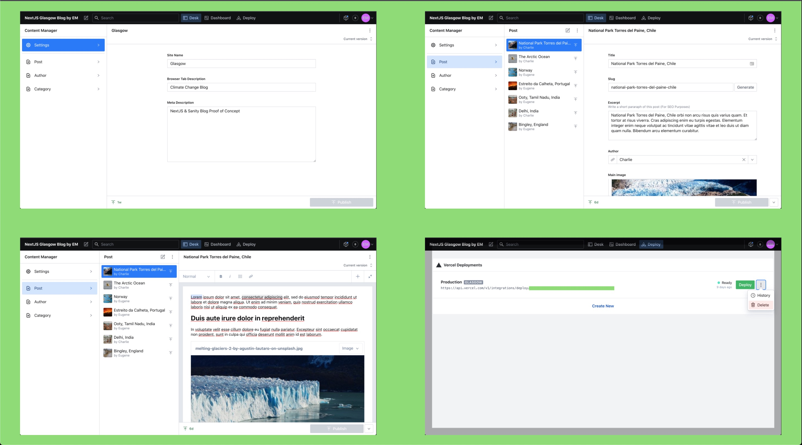

[NextJS](https://nextjs.org/) & [Sanity](https://www.sanity.io/) blog proof of concept.

[Live demo](https://glasgow.vercel.app/)

## Theme

Since [COP26](https://ukcop26.org/) is on these days (Nov 2021), I thought I would use some dummy content with reference to some of the consequences of global warming.

## Features

- Header with editable site title & description
- Blog index with featured image, title, category, excerpt, published date and author
- Blog post template with the same features as the blog index but rich text instead of the excerpt
- The blog post template also feature a `like` button (server side function)
- Minimal style, no css framework
- Footer
- Mobile friendly (needless to say)
- Images from [Unsplash](https://unsplash.com/), see `alt` attributs for credits
- [Baumans](https://fonts.google.com/specimen/Baumans) and [Montserrat](https://fonts.google.com/specimen/Montserrat) Google fonts
- Hosted on [Vercel](https://vercel.com/) (for free)

## Behind the Scenes

- Integration with [Sanity](https://www.sanity.io/), the unified content platform (free tier)
- Singleton with site settings
- Custom meta tag description for SEO
- [Dynamically generated](https://github.com/eugelogic/glasgow/blob/main/components/Layout.js#L15) titles for `<title>` tags
- FormatDate component https://github.com/eugelogic/glasgow/blob/main/components/FormatDate.js
- Create, edit, unpublish, duplicate or delete posts, authors and categories via the UI
- Deploy directly form the UI with the [Sanity Vercel deploy plugin](https://www.sanity.io/plugins/vercel-deploy)
- Option to deploy to `staging` with dedicated url eg https://glasgow-qoc6w3fse-eugelogic.vercel.app/

## Screenshots

Here are some screenshots showing the Sanity CMS area

## Wish List

Features to be added on the next iteration.

- [ ] Real time edit content preview on front end (https://www.sanity.io/guides/nextjs-live-preview)
- [ ] SEO optimisation for posts
- [ ] Pagination for blog index
- [ ] Static pages, ie: About & Contact
- [ ] Website menu navigation
- [ ] Tailwind CSS styling

## Source

This project was mainly inspired by [Learn Next.js and Make React Development Simpler](https://www.freecodecamp.org/news/learn-next-js/)
